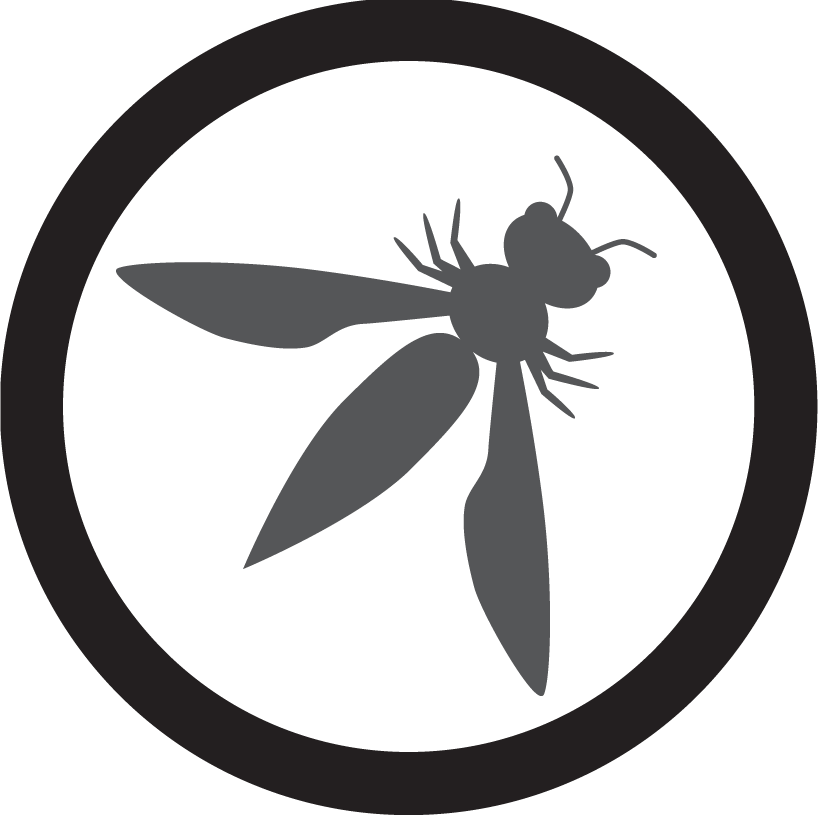

# OWASP TimeGap Theory
An auto-scoring capture-the-flag game focusing on TOCTOU vulnerabilities

 

### Deploy on Heroku (free ($0/month) dyno)

1. [Sign up to Heroku](https://signup.heroku.com/) and
   [log in to your account](https://id.heroku.com/login)
2. Click the button below and follow the instructions

[](https://heroku.com/deploy)

> This is the quickest way to get a running instance of TimeGap Theory! If
> you have forked this repository, the deploy button will automatically
> pick up your fork for deployment! As long as you do not perform any
> DDoS attacks you are free to use any tools or scripts to hack your
> TimeGap Theory instance on Heroku!

### Run on Docker (free)

Quickest way:

```
docker pull abhibala/owasp-timegaptheory

cd TimeGap-Theory

docker-compose up -d
```


1. Install [Docker Desktop](https://www.docker.com/products/docker-desktop).
2. Obtain the [source code](https://github.com/Abhi-M/timegaptheory.git).
3. Open Terminal and navigate to the TimeGap Theory directory.
4. Issue the following command: docker-compose up -d
5. On your browser navigate to http://localhost/
